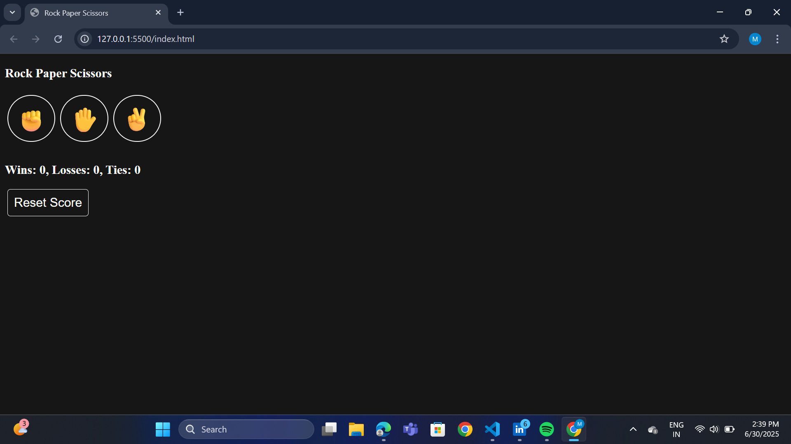
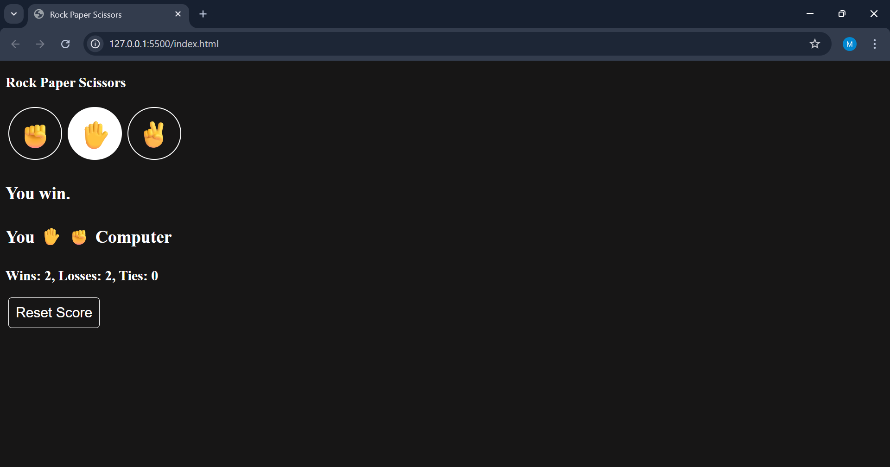

# ✊✋✌️ Rock Paper Scissors Game

A clean and responsive emoji-based Rock Paper Scissors game built with HTML, CSS, and JavaScript.

## 🔍 Features
- Emoji buttons for interaction
- Score tracking and result display
- Responsive layout
- Reset functionality

##🔁 Game Logic Flow
        [Player selects Move]
                |
        -------------------------
        |           |           |
      Rock        Paper      Scissors
        |           |           |
        v           v           v
   vs Computer   vs Computer   vs Computer
        |           |           |
        v           v           v
   ----------- Decision Logic ------------
        |           |           |
   Win, Lose, or Tie based on:
   - Rock beats Scissors
   - Paper beats Rock
   - Scissors beats Paper

## 🖼️ Screenshots

## 🚀 How to Use
Open `index.html` in your browser—or use Live Server if you're working in VS Code.

